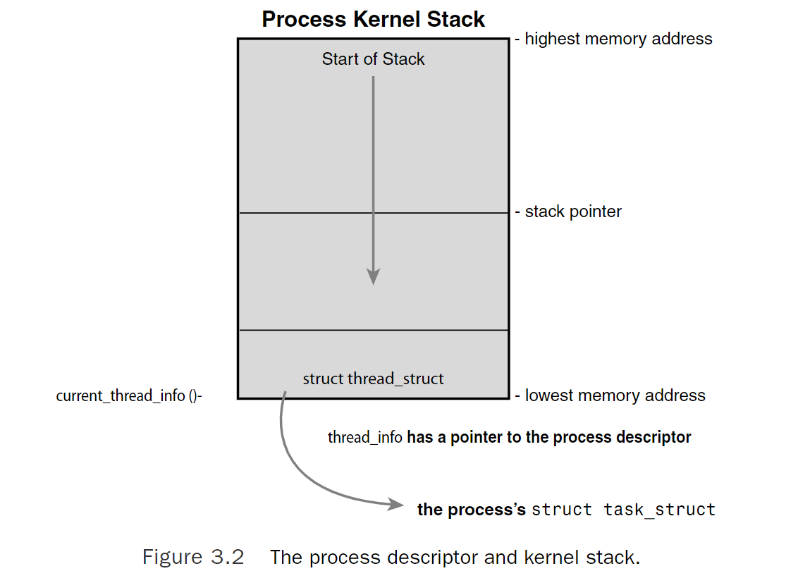
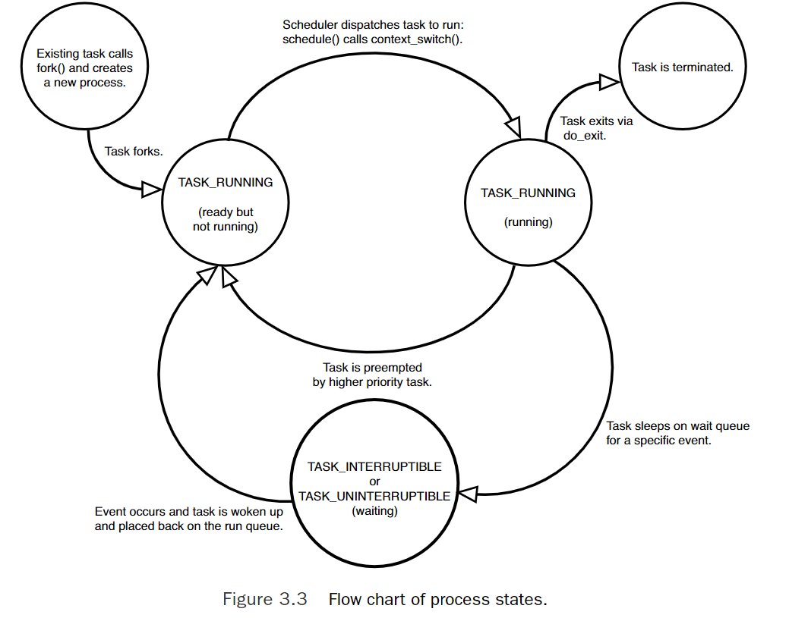

# Process Management

## The Process

- executing program (text section) + resources (open files, pending signals. internal kernel data, processor state, memory address space, threads of execution, data section)
- Each thread includes *unique program counter*, *process stack*, & *set of processor registers*. **Kernel schedules individual threads, not processes**
- Linux does not differentiate between threads & processes. Thread is just special kind of process.

**Creation of process**

- In linux, process is created using `fork()` system call, which creates a new process by duplicating an existing one.
- Parent resumes execution & child starts execution where `fork()` returns. `fork()` syscall returns twice from kernel (parent & child)
- As child is running same program, it is desirable to to call `exec()` immediately after `fork()` to create a new address space & loads a new program into it.
- program exists via `exit()` syscall. parent can wait for child to exit using `wait4()` syscall.

## Process Descriptor & Task Structure

- kernel stores list of processes in a **circular doubly linked list** called `task list`.
- each element in the task list is **process descriptor** of the type [`struct task_struct`][linux/sched.h#task_struct] which is defined in [<linux/sched.h>][linux/sched.h#task_struct]

### Allocating Process Descriptor

- [`task_struct`][linux/sched.h#task_struct] is allocated via **slab allocator** to provide object reuse and cache coloring.
- Prior to 2.6 kernel series, [`struct task_struct`][linux/sched.h#task_struct] was stored to end of the kernel stack of each process. This allowed architectures with few registers, such as x86, to calculate the location of process description via **stack pointer** without using extra register to store location.
- with process descriptor now dynamically created via slab allocator, new structure `struct thread_info` [x86 <asm/thread_info.h>][x86/include/asm/thread_info.h#thread_info] | [How 'task_struct' is accessed via 'thread_info' in linux latest kernel?](https://stackoverflow.com/questions/70043591/how-task-struct-is-accessed-via-thread-info-in-linux-latest-kernel) was created that again lives to end of kernel stack.



### Storing Process Descriptor

- System identifies process by **unique process identification (pid)**. PID is numerial value represented by opaque type `pid_t` which is typically an `int`.
- Maximun value can be **32768** which can be increased as high as four million (check [<linux/threads.h>](https://github.com/torvalds/linux/blob/v5.17/include/linux/threads.h))
- If system is willing to break compatibility with old applications, max value can be increased via `proc/sys/kernel/pid_max`
- Inside kernel, tasks are typically referenced directly by a pointer to their [`task_struct`][linux/sched.h#task_struct]. Which is done via `current` macro (This macro must be independently implemented by each architecture). Generic `current` macro defined [<asm-generic/current.h>](https://github.com/torvalds/linux/blob/v5.17/include/asm-generic/current.h) which calls function `get_current()` which calls `current_thread_info()`. (Arch specific, for [x86](https://github.com/torvalds/linux/blob/v5.17/arch/x86/include/asm/current.h))
- Some architectures save pointer to [`task_struct`][linux/sched.h#task_struct] of currently running process in a register, enabling efficient access.

## Process State

Each processon the system is in exactly one of the **five** different states. Code [<linux/sched.h>](https://github.com/torvalds/linux/blob/v5.17/include/linux/sched.h)

- **TASK_RUNNING**: Process is runnable. It is either currently running (user/kernel space) or on a run queue waiting to run.
- **TASK_INTERRUPTIBLE**: Process is sleeping (blocked), waiting for some condition to exist.
- **TASK_UNINTERRUPTIBLE**: This state is identical to TASK_INTERRUPTIBLE except that it *does not wake up and become runnable if it recieves a signal*.
  
  >This is why you have those dreaded unkillable processes with state D in ps(1). Because the task will not respond to signals, you cannot send it a SIGKILL signal. Further, even if you could terminate the task, it would not be wise because the task is supposedly in the middle of an important operation and may hold a semaphore
- **__TASK_TRACED**: The process is being *traced* by another process, such as a debuger via *ptrace*
- **__TASK_STOPPED**: Process execution has stopped. Task is not running nor is it eligible to run. This occurs if the task receives the **SIGSTOP, SIGTSTP, SIGTTIN or SIGTTOU** signal. or if it receives any signal while it is being debugged.



### Manipulating Current Process State

Kernel code often needs to change a process's state. 

```c
// looks like this is removed
// https://lore.kernel.org/lkml/1483121873-21528-1-git-send-email-dave@stgolabs.net/
// but same commit on github dont have change https://github.com/torvalds/linux/commit/be628be09563f8f6e81929efbd7cf3f45c344416
set_task_state(task, state);
```

Another method which I believe currently getting used is

```c
// https://github.com/torvalds/linux/blob/v5.17/include/linux/sched.h
set_current_state(state);
```

### Process Context

- Normal program executes in *user space*. When program executes **syscall or trigger exception**, it enters into *kernel space* (**Kernel is executing on behalf of process**) & is in process context.
- When in process context, the `current` macro is valid.
- Upon exiting kernel, the process resumes execution unless higher priority process has become runnable.

>Suppose while running normal process, interrupt happens. Then system is not running on behalf of a process but is executing an interrupt handler. No process is tied to interrupt handlers.

### Process Family Tree

- All processes are descendants of `init` process (PID=1). Kernel starts `init` in last step of boot process. `init` process reads system **initscripts** and execute more programs.
- Every process on system has exactly **one parent** and **zero or more children**.
- relationship between processes is stored in process descriptor. Each [`task_struct`][linux/sched.h#task_struct] has a pointer to parent's [`task_struct`][linux/sched.h#task_struct] named `parent` and list of children, named `children` ([Check](https://github.com/torvalds/linux/blob/v5.17/include/linux/sched.h#L954-L970))
- `init` task's descriptor is statically allocated as `init_task`

```c
struct task_struct *task;

for_each_process(task) {
    printk("%s[%d]\n", task->comm, task->pid);
}
```

## Process Creation

- Most OS implements *spawn* mechanism to create a new process in a new address space, read in an executable, and begin executing it.
- but in Linux, we have `fork()` and `exec()` 2 syscall to achieve same.
- `fork()` creates child process that is copy of current task. then `exec()` loads new executable into address space and begins executing it.

### Copy-on-Write

- Traditionally, upon `fork()`, all resources owned by parent are duplicated and copy is given to child. This is inefficient because if new process were to immediately execute new image, all copying would go waste.
- In Linux, `fork()` is implemented through the use of **copy-on-write**. It is technique to delay or altogether prevent copying of data. Rather than duplicate process address space, parent & child share single copy.
- When child write, duplicate is made available.

### Forking

- Linux implements fork() via the clone() system call.This call takes a series of flags that specify which resources, if any, the parent and child process should share. (Check [syscalls declared](https://github.com/torvalds/linux/blob/v5.17/include/linux/syscalls.h) | [definition](https://github.com/torvalds/linux/blob/v5.17/kernel/fork.c))
- syscall `fork()` calls routine [`pid_t kernel_clone(struct kernel_clone_args *args)`](https://github.com/torvalds/linux/blob/v5.17/kernel/fork.c#L2524)
- [`kernel_clone`][kernel/fork.c#kernel_clone] internally calls [`copy_process`](https://github.com/torvalds/linux/blob/v5.17/kernel/fork.c#L1902)
  ```c
  static __latent_entropy struct task_struct *copy_process(
					struct pid *pid,
					int trace,
					int node,
					struct kernel_clone_args *args)
  ```
- Deliberately, the kernel runs the child process first. In the common case of the child simply calling exec() immediately, this **eliminates any copy-on-write overhead** that would occur if the parent ran first and began wr iting to the address space.

### vfork()

The `vfork()` system call has the same effect as `fork()`, except that the **page table entries of the parent process are not copied**. Instead, the child executes as the sole thread in the parent’s address space, and the **parent is blocked until the child either calls `exec()` or exits**. The child is **not allowed to write to the address space**.

```c
//https://github.com/torvalds/linux/blob/v5.17/kernel/fork.c#L2620-L2646

// fork args
struct kernel_clone_args args = {
    .exit_signal = SIGCHLD,
};

// vfork args
struct kernel_clone_args args = {
    .flags		= CLONE_VFORK | CLONE_VM,
    .exit_signal	= SIGCHLD,
};
```

#### How `vfork()` is done?

1. In [`copy_process()`][kernel/fork.c#copy_process], the [`task_struct`][linux/sched.h#task_struct] member `vfork_done` (of type [`completion`][linux/completion.h#completion]) is set to `NULL` ([Ref](https://github.com/torvalds/linux/blob/v5.17/kernel/fork.c#L2051))
2. In [`kernel_clone`][kernel/fork.c#kernel_clone] (previously `do_fork`), if special flag (`CLONE_VFORK`) was given, `vfork_done` is pointed at specific address. ([Ref](https://github.com/torvalds/linux/blob/v5.17/kernel/fork.c#L2583-L2587))
3. After the child is first run, the parent —instead of returning— waits for the child to signal it through the `vfork_done` pointer.
4. In the [`mm_release()`][kernel/fork.c#mm_release] function, which is used when a task exits a memory address space, `vfork_done` is checked to see whether it is `NULL`. If it is not, the parent is signaled. ([Ref](https://github.com/torvalds/linux/blob/v5.17/kernel/fork.c#L1410-L1411))
5. Back in [`kernel_clone()`][kernel/fork.c#kernel_clone], the parent wakes up and returns.

>If this all goes as planned, the **child is now executing in a new address space or exited**, and the parent is again executing in its original address space

## Linux Implementation of Threads

Threads provide multiple threads of execution within the same program in **shared memory address space (can also share open files & other resources)**.

> To linux kernel, there is no concept of thread. Linux implements all threads as standard process. **thread is a process that shares certain resources with other processes**. Each thread has its unique `task_struct`.

### Creating Threads

It is same as normal tasks, with the exception that `clone()` syscall is passed flags ([**flags**][uapi/linux/sched.h#flags] are part of structure [`kernel_clone_args`][linux/sched/task.h#kernel_clone_args]) corresponding to specific resources to be shared. ([Ref](https://github.com/torvalds/linux/blob/v5.17/kernel/fork.c#L2152-L2175))

```c
// normal fork
clone(SIGCHLD, 0);

// vfork
clone(CLONE_VFORK | CLONE_VM | SIGNCHLD, 0);

// Threads
// fork the process but share
// address space, filesystem, file descriptors, signal handlers
clone(CLONE_VM | CLONE_FS | CLONE_FILES | CLONE_SIGHAND, 0);
```

- **Declaration**: [clone()](https://github.com/torvalds/linux/blob/v5.17/include/linux/syscalls.h#L886-L897) | [clone3()](https://github.com/torvalds/linux/blob/v5.17/include/linux/syscalls.h#L899)
- **Definition**: [clone()](https://github.com/torvalds/linux/blob/v5.17/kernel/fork.c#L2648-L2684) | [clone3()](https://github.com/torvalds/linux/blob/v5.17/kernel/fork.c#L2686L2842)

### Kernel Threads

- Kernel does some operations in background via *kernel threads*—**standard processes that exist solely in kernel-space.**
>Unlike normal processes, kernel threads do not have an address space. (their `mm` pointer is `NULL`)
- They operate only in kernel space and do not context switch into user space. These threads are **schedulable & preempatble**, same as normal processes.
- Examples of kernel thread `flush` tasks & `ksoftirqd` task
- Kernel threads are created on system boot by **other kernel threads only.** and it is done by forking `kthreadd` kernel process. ([linux/kthread.h](https://github.com/torvalds/linux/blob/v5.17/include/linux/kthread.h))

#### How kernel thread gets created?

- Existing kernel thread can spawn new kernel thread using macro `kthread_create()` which calls [`linux/kthread.h#kthread_create_on_node()`](https://github.com/torvalds/linux/blob/v5.17/include/linux/kthread.h)

**WIP**

## Process Termination

When a process terminates, the **kernel releases the resources owned by the process** and **notifies the child’s parent** of its demise.

To die, process can call ([`exit()`](https://github.com/torvalds/linux/blob/v5.17/kernel/exit.c#L900-L903)) syscall which internally calls [`do_exit()`][kernel/exit.c#do_exit].

#### What `do_exit()` does?

**WIP**

>The task is not runnable (and no longer has an address space in which to run) and is in the `EXIT_ZOMBIE` exit state.The only memory it occupies is its **kernel stack, thethread_info structure, and the task_struct structure**.The task exists solely to **provide information to its parent**. After the parent retrieves the information, or notifies the kernel that it is uninterested, the remaining memory held by the process is freed and returned to the system for use.

### Remove Process Descriptor

When parent acknoledged about child's death, now finally deallocation of process descriptor can be done using [`kernel/exit.c#release_task()`][kernel/exit.c#release_task]

### Dilemma of Parentless Task

If a parent exits before its children, some mechanism must exist to reparent any child tasks to a new process, or else parentless terminated processes would forever remain zombies, wasting system memory.The solution is to reparent a task’s children on exit to **either another process in the current thread group or, if that fails, the init process**.

[`do_exit()`][kernel/exit.c#do_exit] calls [`exit_notify(tsk, group_dead);`](https://github.com/torvalds/linux/blob/v5.17/kernel/exit.c#L826). `exit_notify` will tell all relatives about demise. ([kernel/exit.c#exit_notify][kernel/exit.c#exit_notify])

**WIP**

[linux/sched.h#task_struct]: https://github.com/torvalds/linux/blob/v5.17/include/linux/sched.h#L728-L1510
[x86/include/asm/thread_info.h#thread_info]: https://github.com/torvalds/linux/blob/v5.17/arch/x86/include/asm/thread_info.h
[kernel/fork.c#copy_process]: https://github.com/torvalds/linux/blob/v5.17/kernel/fork.c#L1894-L2461
[linux/completion.h#completion]: https://github.com/torvalds/linux/blob/v5.17/include/linux/completion.h#L26-L29
[kernel/fork.c#kernel_clone]: https://github.com/torvalds/linux/blob/v5.17/kernel/fork.c#L2516-L2602
[kernel/fork.c#mm_release]: https://github.com/torvalds/linux/blob/v5.17/kernel/fork.c#L1368-L1412
[uapi/linux/sched.h#flags]: https://github.com/torvalds/linux/blob/v5.17/include/uapi/linux/sched.h#L10-L44
[linux/sched/task.h#kernel_clone_args]: https://github.com/torvalds/linux/blob/v5.17/include/linux/sched/task.h#L21-L37
[kernel/exit.c#do_exit]: https://github.com/torvalds/linux/blob/v5.17/kernel/exit.c#L733-L858
[kernel/exit.c#release_task]: https://github.com/torvalds/linux/blob/v5.17/kernel/exit.c#L183-L231
[kernel/exit.c#exit_notify]: https://github.com/torvalds/linux/blob/v5.17/kernel/exit.c#L663-L707